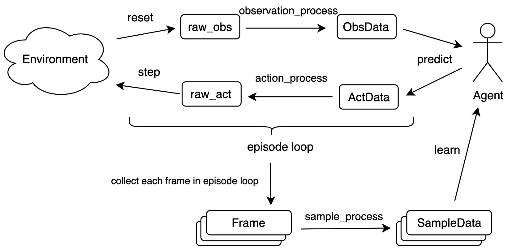

# 开悟比赛代码逻辑

## 环境启动

### 本地命令行打开Docker容器

可以不使用官方给客户端(但是生成访问许可 `license.bat` 和获得下载镜像的权限还是要用下客户端的), 找到你的工作路径下的 `/dev/` 文件夹下的 `.docker-compose.yaml` 文件, 执行
```shell
docker compose -f "{你的工作路径}\dev\.docker-compose.yaml" -p "kaiwu-dev" up -d
```
即可启动 docker 容器, 然后通过 Docker desktop 左侧的 containers 查看容器端口转发的网址, 点击网址即可打开在线版的 VsCode. 

> Linux 上使用也是类似的, 但问题是没有镜像的下载权限(也可以直接拷贝镜像), 还需要研究下
### 本地代码编辑
由于没有找到docker启动命令, 打开腾讯开悟客户端, 打开本地开发环境, 可以看出来启动了三个镜像  `win_gpu, gamecore_x86, pushgatway_x86`, 第一个应该是nvidia-docker, 第二个应该是环境内核, 最后一个应该是环境代码, 至于三个镜像如何相互发现对方, 应该是开放了公用的工作空间. 

默认将本机的 `10001` 端口映射到 `8080`, 打开 `localhost:10001` 即可进入在线版本的vscode, 由于体验太差, 本地vscode可以通过安装 `Remote Explorer` 和 `Dev Containers`, 点击左下角按钮, 选择附加到正在运行的容器, 选择 `.../win_gpu/...` 即可进入容器. 

不同任务的工作路径均在 `/data/projects/` 下, 例如**峡谷漫步**的工作文件夹为 `gorge_walk/`, 进入后可以发现, 他将我们在开悟客户端中设置的文件夹下挂载到了 `/workspace/code/` . 

**注意**: 由于他们只将本机挂载文件中的部分文件进行了链接: 

- 峡谷漫步中只有: `.vscode, ckpt, conf, diy, dynamic_programming, monte_carlo, q_learning, sarsa, train_test.py`

这意味着, 如果我们直接向根目录下直接创建文件是创建在docker中的, 而非本机, docker关闭创建的文件也会被删除, 因此**只有将文件保存在链接的文件夹中**才能在本机上进行保存. 

> 或者你可以先在本机的工作路径中创建文件后, 使用 `ln -s /workspace/code/your_folder /data/projects/{任务名}/` 手动挂载自定义的文件夹. 

## 代码逻辑

### 配置文件

执行 `train_test.py` 首先会基于你给的变量对 `/config/` 下配置文件进行更新, 这包含: 

- `/conf/`: 对环境进行配置, 通过 `kaiwudrl.common.config.config_control.CONFIG` 进行读取, 其中
  -  `kaiwudrl/configure.toml` 是核心配置文件, 包含日志文件配置、模型保存位置等(有好多配置都是废的)
  - `kaiwudrl/leaner.toml` 是对智能体信息的配置, 名称 `svr_name`、编号 `svr_index`、端口号 `svr_ports` 等
  - `configure_app.toml` 是用户的最高级配置, 相同参数会将 `kaiwudrl/` 的配置覆盖

配置的存储格式为 `toml`, 使用 [`Dynaconf`](https://dynaconf.com/) 进行读取, 使用 `config.load_file` 读取配置文件, 然后就会将其转为类似字典格式, 然后直接用索引就能获取到键值, 注意和 `json` 不同的是, `toml` 的具体参考 [toml.io](toml.io). 

**配置逻辑**: 

1. 设定配置文件 `CONFIG.set_configure_file(file_path)`, 例如 `conf/kaiwudrl/actor.toml, learner.toml`
2. 解析配置文件 `CONFIG.parse_actor_configure(), parse_learner_configure()` 解析函数需要和上面的配置文件对应, 因为需要按照关键字选择读取的字典
3. 解析都会使用 `CONFIG.load_data_from_config`, 解析会将指定字典的键值对直接赋值到 `CONFIG` 的属性中, 因此顺序非常重要, 以 `parse_actor_configure()` 为例, 赋值的字典顺序为 `actor (kaiwudrl/actor.toml) -> main (kaiwudrl/configure.toml) -> app (configure_app.toml)`

## 算法开发流程

开发流程[参考官方介绍](https://doc.aiarena.tencent.com/competition/gorgewalk/1.0.0/guidebook/code-guide/)中写道, 他们将强化学习流程抽象为两个循环部分: 


1. `Env -> raw_obs -> ObsData -> Agent -> ActData -> raw_act -> Env`: 环境交互流程, 策略的探索与利用
2. `trajactory -> Frame buffer -> Sample Data -> update Agent -> trajectory`: 存储轨迹到buffer中, 从buffer中采样, 更新智能体模型, 再收集新轨迹. 

## 模型上传

使用 `APP` 训练模型非常慢效率极低, 我们通过 `train_test.py` 文件快速获取上传的模型文件, 可以发现模型会自动保存到 `/work`, 首先我们可以只保留需要的策略, `/gorge_walk/{你的模型}` 之外的模型文件夹都的可以删除. 

## 分布式开发
首先需要启动learner和aisvr, 它们分别会启动一个Agent, 在每个aisvr上还会启动一个env用于交互, aisvr用于收集数据, 调用agent.learn将数据传给learner, learner再自己决定收集多少数据后进行一次更新, 使用 `agent.load_model('latest')` 更新aisvr的智能体参数. 

底层用到的相关代码 `kaiwudrl.server.aisrv.aisrv_server.py`

### 配置文件
#### 算法配置
对算法所需的训练器、验证器、训练流、验证流函数位置进行定位, 这些代码全部在 `kaiwudrl.common.config.algo_conf._AlgoConf` 类中(也是单例模式, 包含一个实例化对象 `AlgoConf`), 通过配置文件 `conf/nature_algo_[环境名].yaml` 对 `config_map` 进行初始化, 外部调用 `AlgoConf` 的属性时, 就会**直接引用配置文件中字符串对应的函数或类**. 下面对其配置进行具体分析: 
1. `actor_model, learner_model, aisrv_model`: 三个模型默认都是用 `[算法名].algorithm.agent.Agent` 类
2. `trainer`: `kaiwudrl.server.learner.standard_trainer.StandardTrainer`
3. `predictor`: `kaiwudrl.server.actor.standard_predictor.StandardPredictor`
4. `train_workflow`: `[算法名].train_workflow.workflow`
5. `eval_workflow`: `kaiwu_agent.[环境名].[算法名].eval_workflow.workflow`
#### 环境配置
对环境所需的通讯接口, 状态空间, 动作空间进行定义, 代码位于 `kaiwudrl.common.config.app_conf.AppConf._AppConf` 下(单例模式, 也包含一个实例化对象 `AppConf`), 配置文件位于 `conf/nature_app_[环境名].yaml` 下, 

### learner逻辑
1. 进程启动: 通过多进程启动一个 `learner.main()`: `procs.append(Process(target=learner.main, name="learner"))`
2. 此函数位于 `kaiwudrl/server/learner/learner.py` 中的 `main()`, 调用 `train_loop()`, 通过 `conf/kaiwudrl/configure.toml` 中配置的训练框架 `framework_integration_patterns`(默认为 `normal`), 初始化训练器 `trainer = AlgoConf[CONFIG.algo].trainer()`, 也就是 `kaiwudrl.server.learner.standard_trainer.StandardTrainer` 类的实例化, 再调用 `train.loop()` 进入到 `kaiwudrl.server.learner.on_policy_trainer.loop()` 中.
3. 进去后就进入训练循环中, 分别调用 `on_policy_trainer.run_once() -> on_policy_trainer.train() -> on_policy_trainer.train_detail() -> common.algorithms.model_wrapper_pytorch.ModelWrapperPytorch.train() -> [算法名].algorithms.Agent.learn(data)`, 这里 `data` 根据

### aisvr逻辑
1. 进程启动: `aisrv.main()`
2. 启动 `kaiwudrl.server.aisrv.aisrv_server_standard.AiServer.run() -> AiServer.before_run()`, 其中创建了一个类 `simu_ctx` 用来管理所有使用到的类, `AiServer.start_aisrv_handler()` 启动进程, 对每个 `kaiwu_env_address` 使用 `AiSrvHandle` 启动单个进程.
3. `AiSrvHandle.run() -> AiSrvHandle.before_run() -> simu_ctx.kaiwu_rl_helper(simu_ctx) -> kaiwu_rl_helper.start()` 开启kaiwu_rl_helper线程
4. `kaiwudrl.server.aisrv.kaiwu_rl_helper_standard.KaiWuRLStandardHelper.run -> KaiWuRLStandardHelper.workflow() -> AlgoConf[CONFIG.algo].train_workflow`, 在 `KaiWuRLStandardHelper.workflow()` 中初始化环境, 并调用用户的 `train_workflow` 函数.

### save_model逻辑
模型保存仅在learner上执行
#### 保存模型究竟有多少触发方法, 它们保存的位置是一样的么?
保存位置不一样, 它们在保存时的 `source` 这个传参不一样, 下述第一种保存的模型会同步到模型池, 用于和aisrv同步, 而后两种保存方法是可以直接同步到本地的, 但是不能同步到模型池, 各有利弊.
> 需要注意, 后两种保存方法收到 CONFIG 中 user_save_mode_max_count 参数的限制, 默认只允许保存200次, 但是我们可以直接在 configure_app.toml 中设置 user_save_mode_max_count=0 就是无限次数了, 或者复杂点 (这个方法只适合在leaner中也就是 `agent.learn` 函数中使用, 因为aisrv需要通信), 我们假装自己是框架的保存方法, 在保存时候写 `self.save_model(path=f"{CONFIG.user_ckpt_dir}/{CONFIG.app}_{CONFIG.algo}/", source='framework')` 需要导包 `from kaiwudrl.common.config.config_control import CONFIG`, 这样也能无限次保存了.
保存逻辑都是要经过 `kaiwudrl.common.algorithms.standard_model_wrapper_pytorch.StandardModelWrapperPytorch.save_param(...)`, 此处会传入一个
1. 按照步数的倍数, 自动保存模型: 直接在 `kaiwudrl.common.algorithms.standard_model_wrapper_pytorch.StandardModelWrapperPytorch.after_train(...)` 中 (这个函数会被 `train(...)` 调用, 而这个 `train(...)` 在leaner逻辑中写了, 他会被死循环调用), 当前训练次数达到 `CONFIG.dump_model_freq` 的倍数时候, 就会直接调用 `model.save_model(...)` 保存, 保存路径位于 `{CONFIG.restore_dir}/{CONFIG.app}_{CONFIG.algo}/`, `source='framework'` (例如 `/data/ckpt/back_to_the_realm_dqn/model.ckpt-*.pkl`).
2. 在 `agent.learn(...)` 函数中使用 `agent.save_model()` 手动进行保存的 traceback 信息如下:
```bash
[DEBUG] FROM </data/projects/back_to_the_realm/dqn/algorithm/agent.py, line 284> in save_model +++++++++++++++++++++++++
[DEBUG] IN   </data/projects/back_to_the_realm/kaiwudrl/common/algorithms/standard_model_wrapper_pytorch.py, line 146> in do_save_param 
[DEBUG] IN   </data/projects/back_to_the_realm/kaiwudrl/common/algorithms/standard_model_wrapper_pytorch.py, line 251> in save_param_detail 
[DEBUG] IN   </data/projects/back_to_the_realm/kaiwudrl/common/algorithms/standard_model_wrapper_pytorch.py, line 178> in save_param 
[DEBUG] IN   </data/projects/back_to_the_realm/kaiwudrl/interface/base_agent_kaiwudrl_remote.py, line 149> in wrapper ++
[DEBUG] IN   </data/projects/back_to_the_realm/dqn/algorithm/agent.py, line 269> in learn ++++++++++++++++++++++++++++++
[DEBUG] IN   </data/projects/back_to_the_realm/kaiwudrl/interface/base_agent_kaiwudrl_remote.py, line 73> in wrapper +++
[DEBUG] IN   </data/projects/back_to_the_realm/kaiwudrl/common/algorithms/standard_model_wrapper_pytorch.py, line 314> in train 
[DEBUG] IN   </data/projects/back_to_the_realm/kaiwudrl/server/learner/on_policy_trainer.py, line 129> in train_detail +
[DEBUG] IN   </data/projects/back_to_the_realm/kaiwudrl/server/learner/on_policy_trainer.py, line 1409> in train +++++++
[DEBUG] IN   </data/projects/back_to_the_realm/kaiwudrl/server/learner/on_policy_trainer.py, line 1449> in run_once ++++
[DEBUG] IN   </data/projects/back_to_the_realm/kaiwudrl/server/learner/on_policy_trainer.py, line 1482> in loop ++++++++
[DEBUG] IN   </data/projects/back_to_the_realm/kaiwudrl/server/learner/learner.py, line 144> in train_loop +++++++++++++
[DEBUG] IN   </data/projects/back_to_the_realm/kaiwudrl/server/learner/learner.py, line 167> in main +++++++++++++++++++
[DEBUG] IN   </data/projects/back_to_the_realm/kaiwudrl/server/learner/learner.py, line 171> in <module> +++++++++++++++
save_model
[DEBUG] END  </data/projects/back_to_the_realm/dqn/algorithm/agent.py, line 284> in save_model -------------------------
```
保存位置为 `{CONFIG.user_ckpt_dir}/{CONFIG.app}_{CONFIG.algo}`, `source='user'` (例如 `/data/user_ckpt_dir/back_to_the_realm_dqn/model.ckpt-*.pkl`), 需要注意的是, 这里的模型不会加入到同步池中和aisrv进行同步, 这里的模型只是保存到本地用的.
3. 在 `train_workflow.workflow(...)` 中 (也就是aisrv进程中) 手动执行 `agent.save_model()` 的 traceback 信息如下:
```bash
[DEBUG] FROM </data/projects/back_to_the_realm/dqn/algorithm/agent.py, line 284> in save_model +++++++++++++++++++++++++
[DEBUG] IN   </data/projects/back_to_the_realm/kaiwudrl/common/algorithms/standard_model_wrapper_pytorch.py, line 146> in do_save_param 
[DEBUG] IN   </data/projects/back_to_the_realm/kaiwudrl/common/algorithms/standard_model_wrapper_pytorch.py, line 251> in save_param_detail 
[DEBUG] IN   </data/projects/back_to_the_realm/kaiwudrl/common/algorithms/standard_model_wrapper_pytorch.py, line 178> in save_param 
[DEBUG] IN   </data/projects/back_to_the_realm/kaiwudrl/interface/base_agent_kaiwudrl_remote.py, line 149> in wrapper ++
[DEBUG] IN   </data/projects/back_to_the_realm/kaiwudrl/common/algorithms/standard_model_wrapper_pytorch.py, line 162> in save_param_by_source 
[DEBUG] IN   </data/projects/back_to_the_realm/kaiwudrl/server/learner/on_policy_trainer.py, line 1185> in save_model_detail 
[DEBUG] IN   </data/projects/back_to_the_realm/kaiwudrl/server/learner/on_policy_trainer.py, line 1268> in learner_process_message_by_aisrv 
[DEBUG] IN   </usr/lib64/python3.11/threading.py, line 982> in run +++++++++++++++++++++++++++++++++++++++++++++++++++++
[DEBUG] IN   </usr/lib64/python3.11/threading.py, line 1045> in _bootstrap_inner +++++++++++++++++++++++++++++++++++++++
[DEBUG] IN   </usr/lib64/python3.11/threading.py, line 1002> in _bootstrap +++++++++++++++++++++++++++++++++++++++++++++
save_model 
[DEBUG] END  </data/projects/back_to_the_realm/dqn/algorithm/agent.py, line 284> in save_model -------------------------
```
可以看出, 这个保存方法就是在 learner 与 aisrv 通过 `learner_process_message_by_aisrv()` 通讯后还是使用相同的调用方法进行保存的, 保存位置也相同.

### load_model逻辑
在分布式训练中, 读取模型需要训练模型先通过一个 `model_file_sync` 进程来下拉当前 learner 存储的最新模型, 然后 aiver 再通过 load_model 调用最新模型, 问题:
#### 为什么四个进程在基本同时读取模型时, 仅输出一次模型信息? 
因为它们共享同一个进程去专门做预测, 这个进程初始化时会输出:
```bash
# 这是aisrv中输出的额用于模型预测的进程
2024-08-10 19:45:37.255 | INFO     | kaiwudrl.server.aisrv.actor_proxy_local:before_run:604 - actor_proxy_local policy_name: train_one, start success at pid 223, actor_receive_cost_time_ms: 1, predict_batch_size: 1
```
模型预测predict的traceback如下
```bash
[DEBUG] FROM </data/projects/back_to_the_realm/dqn/algorithm/agent.py, line 177> in predict ++++++++++++++++++++++++++++
[DEBUG] IN   </data/projects/back_to_the_realm/kaiwudrl/interface/base_agent_kaiwudrl_remote.py, line 95> in wrapper +++
[DEBUG] IN   </data/projects/back_to_the_realm/kaiwudrl/common/algorithms/standard_model_wrapper_pytorch.py, line 395> in predict
[DEBUG] IN   </data/projects/back_to_the_realm/kaiwudrl/server/common/predict_common.py, line 113> in predict_detail +++
[DEBUG] IN   </data/projects/back_to_the_realm/kaiwudrl/server/common/predict_common.py, line 359> in standard_predict_simple
[DEBUG] IN   </data/projects/back_to_the_realm/kaiwudrl/server/common/predict_common.py, line 500> in predict ++++++++++
[DEBUG] IN   </data/projects/back_to_the_realm/kaiwudrl/server/aisrv/actor_proxy_local.py, line 896> in run_once_by_direct
[DEBUG] IN   </data/projects/back_to_the_realm/kaiwudrl/server/aisrv/actor_proxy_local.py, line 943> in run ++++++++++++
[DEBUG] IN   </usr/lib64/python3.11/multiprocessing/process.py, line 314> in _bootstrap ++++++++++++++++++++++++++++++++
[DEBUG] IN   </usr/lib64/python3.11/multiprocessing/popen_fork.py, line 71> in _launch +++++++++++++++++++++++++++++++++
[DEBUG] IN   </usr/lib64/python3.11/multiprocessing/popen_fork.py, line 19> in __init__ ++++++++++++++++++++++++++++++++
[DEBUG] IN   </usr/lib64/python3.11/multiprocessing/context.py, line 281> in _Popen ++++++++++++++++++++++++++++++++++++
[DEBUG] IN   </usr/lib64/python3.11/multiprocessing/context.py, line 224> in _Popen ++++++++++++++++++++++++++++++++++++
[DEBUG] IN   </usr/lib64/python3.11/multiprocessing/process.py, line 121> in start +++++++++++++++++++++++++++++++++++++
[DEBUG] IN   </data/projects/back_to_the_realm/kaiwudrl/server/aisrv/async_policy.py, line 219> in __init__ ++++++++++++
[DEBUG] IN   </data/projects/back_to_the_realm/kaiwudrl/server/aisrv/aisrv_server_standard.py, line 597> in before_run +
[DEBUG] IN   </data/projects/back_to_the_realm/kaiwudrl/server/aisrv/aisrv_server_standard.py, line 446> in run ++++++++
[DEBUG] IN   </data/projects/back_to_the_realm/kaiwudrl/server/aisrv/aisrv.py, line 154> in main +++++++++++++++++++++++
[DEBUG] IN   </data/projects/back_to_the_realm/kaiwudrl/server/aisrv/aisrv.py, line 165> in <module> +++++++++++++++++++
pid=223, Predict 
[DEBUG] END  </data/projects/back_to_the_realm/dqn/algorithm/agent.py, line 177> in predict ----------------------------
```
读取模型load_model的traceback如下
```bash
[DEBUG] FROM </data/projects/back_to_the_realm/dqn/algorithm/agent.py, line 288> in load_model +++++++++++++++++++++++++
[DEBUG] IN   </data/projects/back_to_the_realm/kaiwudrl/interface/base_agent_kaiwudrl_remote.py, line 188> in wrapper ++
[DEBUG] IN   </data/projects/back_to_the_realm/kaiwudrl/common/algorithms/standard_model_wrapper_pytorch.py, line 431> in standard_load_model
[DEBUG] IN   </data/projects/back_to_the_realm/kaiwudrl/server/common/predict_common.py, line 272> in standard_load_model_detail
[DEBUG] IN   </data/projects/back_to_the_realm/kaiwudrl/server/common/predict_common.py, line 306> in standard_load_model
[DEBUG] IN   </data/projects/back_to_the_realm/kaiwudrl/server/common/predict_common.py, line 370> in standard_predict_simple
[DEBUG] IN   </data/projects/back_to_the_realm/kaiwudrl/server/common/predict_common.py, line 500> in predict ++++++++++
[DEBUG] IN   </data/projects/back_to_the_realm/kaiwudrl/server/aisrv/actor_proxy_local.py, line 896> in run_once_by_direct
[DEBUG] IN   </data/projects/back_to_the_realm/kaiwudrl/server/aisrv/actor_proxy_local.py, line 943> in run ++++++++++++
[DEBUG] IN   </usr/lib64/python3.11/multiprocessing/process.py, line 314> in _bootstrap ++++++++++++++++++++++++++++++++
[DEBUG] IN   </usr/lib64/python3.11/multiprocessing/popen_fork.py, line 71> in _launch +++++++++++++++++++++++++++++++++
[DEBUG] IN   </usr/lib64/python3.11/multiprocessing/popen_fork.py, line 19> in __init__ ++++++++++++++++++++++++++++++++
[DEBUG] IN   </usr/lib64/python3.11/multiprocessing/context.py, line 281> in _Popen ++++++++++++++++++++++++++++++++++++
[DEBUG] IN   </usr/lib64/python3.11/multiprocessing/context.py, line 224> in _Popen ++++++++++++++++++++++++++++++++++++
[DEBUG] IN   </usr/lib64/python3.11/multiprocessing/process.py, line 121> in start +++++++++++++++++++++++++++++++++++++
[DEBUG] IN   </data/projects/back_to_the_realm/kaiwudrl/server/aisrv/async_policy.py, line 219> in __init__ ++++++++++++
[DEBUG] IN   </data/projects/back_to_the_realm/kaiwudrl/server/aisrv/aisrv_server_standard.py, line 597> in before_run +
[DEBUG] IN   </data/projects/back_to_the_realm/kaiwudrl/server/aisrv/aisrv_server_standard.py, line 446> in run ++++++++
[DEBUG] IN   </data/projects/back_to_the_realm/kaiwudrl/server/aisrv/aisrv.py, line 154> in main +++++++++++++++++++++++
[DEBUG] IN   </data/projects/back_to_the_realm/kaiwudrl/server/aisrv/aisrv.py, line 165> in <module> +++++++++++++++++++
load model /data/ckpt/back_to_the_realm_dqn/models/model.ckpt_back_to_the_realm_dqn_0/model.ckpt-13000.pkl successfully 
[DEBUG] END  </data/projects/back_to_the_realm/dqn/algorithm/agent.py, line 288> in load_model -------------------------
```
模型预测由 `kaiwudrl.server.aisrv.actor_proxy_local.py` 中的 `ActorProxyLocal` 类完成, 流程如下:

首先他也会有一个 `run()`, 进入后会死循环执行 `run_once_by_direct()`, 每次循环会分别执行
1. `periodic_operations()`, 周期性地更新模型为最新, 这里频率在 `configure_app.toml` 中的 `model_file_load_per_minutes` 设置 (单位分钟)
2. `get_predict_request_data_by_direct()` 收集每个环境中 agent 需要的预测请求
3. 如果存在请求, 则通过 `predict_common_object.predict -> predict_common_object.standard_predict_simple()` (`predict_common_object`是`kaiwudrl.server.common.predict_common.PredictCommon`的实例化结果) 对模型的预测和更新消息进行处理
  - 对于预测调用 `PredictCommon.predict_detail(...) -> kaiwudrl.common.algorithms.standard_model_wrapper_pytorch.StandardModelWrapperPytorch.predict(...) -> kaiwudrl.interface.base_agent_kaiwudrl_remote.predict_wrapper(func) -> model.predict(...)` 从而调用用户写的 `predict` 函数
  - 对于更新模型调用 `PredictCommon.standard_load_model(...)`, 加载模型分为两种情况, 如果上一次加载模型请求来自同一ip则直接进行加载, 否则对于不同ip的只有在与上一次加载模型间隔时间超过 `CONFIG.choose_aisrv_to_load_model_or_save_model_max_time_seconds` (在 `conf.kaiwudrl.configure.toml` 中的) 才会进行加载, 调用 `PredictCommon.standard_load_model_detail -> kaiwudrl.common.algorithms.standard_model_wrapper_pytorch.StandardMOdelWrapperPytorch.standard_load_model(...)  -> kaiwudrl.interface.base_agent_kaiwudrl_remote.load_model(func) -> model.load_model(...)`
#### `model_file_sync` 同步模型的频率是什么?
模型同步时会在learner的log中输出
```bash
2024-08-10 19:25:17.364 | INFO     | kaiwudrl.common.checkpoint.model_file_sync:push_checkpoint_to_model_pool:551 - model_file_sync push output_file_name /data/ckpt/back_to_the_realm_dqn/kaiwu_checkpoint_back_to_the_realm_dqn_15000.tar.gz key model.ckpt_back_to_the_realm_dqn_0 to modelpool success,             total push to modelpool succ cnt is 1             total push to modelpool err cnt is 0
```
模型同步流程如下:
同步代码位于 `kaiwudrl.common.checkpoint.model_file_sync.py`
1. 进入 `run()` 中的死循环, 循环中会执行 `ModelFileSync.run_once()` 可以发现他会有个定时器, `configure_app.toml` 中的 `model_file_sync_per_minutes` (单位分钟, 最小1分钟) 就是同步模型池中模型的频率.
2. 执行 `ModelFileSync.push_and_pull_model_file()`, 首先配置中 `CONFIG.use_ckpt_sync` 必须为 `True`
3. 再执行 `ModelFileSync.push_checkpoint_to_model_pool` 中通过 `ModelFileSync.model_pool_apis.push_model` 将压缩好的模型上传到模型池中.


### 学习期-峡谷漫步
执行 `train_test.py` 后, 通过 `kaiwudrl.server.aisrv.kaiwu_rl_helper_standard.KaiWuRLStandardHelper` 中的 `run() -> workflow()`, 创建环境、智能体后通过 `AlgoConf[CONFIG.algo].trainworkflow(...)` 调用我们写的 `train_work.py` 中的 `workflow(...)`. 

## 有趣的东西
### 一些默认变量用法
- `__name__`: 表示被调用的模块名字, 只有主程序被称为 `__main__`, 其他模块名称是相对于主程序而言, 例如 `import foo.bar`, 在 `bar.py` 中输出的 `__name__` 为 `"foo.bar"`. 
- `__path__`: 只有Python包(一个文件夹)下的 `__init__.py` 中才会自动创建该 `list` 变量, 第一个路径就是当前文件夹的, 也就是 `Path(__file__).parent`, 而且只有被其他程序以包形式调用时才有效果(不能单独运行), 和 `import .{包内的代码}` 类似, 只有被调用时才能运行. 
- `def __getattri__(self, attr)`和`def __getattribute__(self, attr)`, 这两个都是调用类属性时候的重定向, 前者更加常用, 假设我们定义了类 `Foo`, `foo` 是对其的实例化, 当我们调用 `foo.bar` 时
  - `__getattri__`: 假如类里面不具有属性 `bar` 时, 则会返回 `__getattri__` 传入字符串 `'bar'` 的结果；
  - `__getattribute__`: 不论类里面是否存在属性, 都直接将其转为字符串传入 `__getattribute__` 中(注意不要重复迭代)
- `sys._getframe().f_code.co_name`: 返回当前正在执行的代码块或函数的名称
### 通过字符串导入包
`from pydoc import locate`: `bar = locate("foo.bar")`, 从 `foo.py` 包中导入 `bar` 函数. 

### 动态创建类
> 使用位置 `kaiwu_agent.utils.common_func.create_cls(cls_name, **kwargs)`

`type(类名, (父类1,父类2,...), 类属性字典)`: `type` 不仅可以查看属性的类别, 还能通过这种方法动态创建类, 其中 `类属性字典` 定义该类所包含的函数、变量等信息. 

### 默认配置读取
`kaiwu_agent/conf/__init__.py`: 自动初始化 `kaiwu_agent/conf/` 下的各种配置文件 `*.yaml, *.ini, *.json, *.tree`
### glob路径管理
迭代获取获取**文件夹** `glob.glob(f"{path}/*/")`, 在最后加上一个 `/` 表示只获取 `path` 路径下的全部文件夹. 
> `/**/` 和 `/*/` 没有任何区别(加多少个 `*` 都一样)

### 单例类

<!-- `kaiwudrl.common.utils.singleton.Singleton` 单例装饰器, 所谓单例, 其实就是对一个类的实例化方法进行重构(在装饰器中就是对 `__call__` 的重构), 原理就是将之前实例化的对象记录了下来, 后续如果有其他位置重新实例化该对象, 则不会再创建新实例, 直接将已有实例返回即可.  -->

> 评价为没啥用, 你在包中直接实例化一个变量, 其他代码都统一调用它不就好了, 就像 `kaiwudrl.commmon.config.config_control.CONFIG` 就是对 `ConfigControl` 的实例化结果. 

### 日志管理

日志管理位于 `kaiwudrl.common.logging.kaiwu_logger.KaiwuLogger`, 他们调用了 [GitHub - loguru](https://github.com/Delgan/loguru), 使用方法也是 `logger.debug, logger.info, logger.warning, logger.error`, 需要注意的是, 有关日志的配置文件也是由 `kaiwudrl.common.config.config_control.ConfigControl` 类进行控制, 由于是**单例**模式, 因此其实例化结果 `CONFIG` 代表全部实例化对象. 

### 杀死包含某关键字的进程
```bash
kill -9 $(pidof 进程名关键字)
```

### 超级神奇的报错
你只需要在 `configure_app.toml` 中的 `predict_local_or_remote = "local"` 下面一行加上这个注释 `# predict_local_or_remote = ` (等于号后面写不写都行), 就会在同步模型时候发生报错, 非常离谱, 原因还未调查.