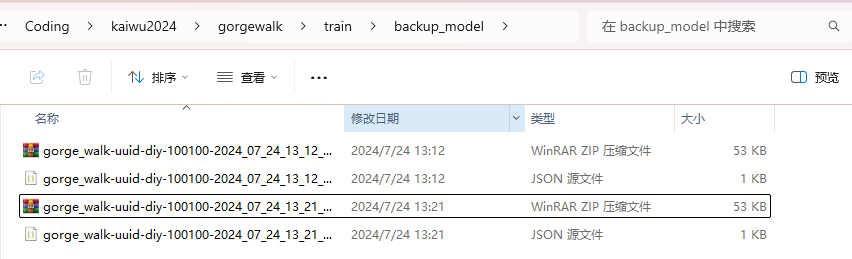

这是一个最简单的保存模型的例子，diy文件结构如下
```bash
diy
 ┣ algorithm
 ┃ ┗ agent.py
 ┣ feature
 ┃ ┗ definition.py
 ┣ config.py
 ┗ train_workflow.py
```

agent.py文件
```python
import numpy as np
from kaiwu_agent.agent.base_agent import BaseAgent
from kaiwu_agent.agent.base_agent import (
    learn_wrapper,
    save_model_wrapper,
    load_model_wrapper,
    predict_wrapper,
    exploit_wrapper,
)

class Agent(BaseAgent):

    def __init__(self, agent_type="player", device=None, logger=None, monitor=None) -> None:
        super().__init__(agent_type, device, logger, monitor)
        self.logger = logger

    @predict_wrapper
    def predict(self, list_obs_data): ...

    @exploit_wrapper
    def exploit(self, list_obs_data): ...

    @learn_wrapper
    def learn(self, list_sample_data): ...

    @save_model_wrapper
    def save_model(self, path=None, id="1"):
        model_file_path = f"{path}/model.ckpt-{str(id)}.pth"
        np.save(model_file_path, [1,2,3])
        self.logger.info(f"save model {model_file_path} successfully")

    @load_model_wrapper
    def load_model(self, path=None, id="1"): ...
```

definition.py文件
```python
from kaiwu_agent.utils.common_func import create_cls, attached

SampleData = create_cls("SampleData", state=None, action=None, reward=None)
ObsData = create_cls("ObsData", feature=None)
ActData = create_cls("ActData", act=None)

@attached
def observation_process(raw_obs):
    return ObsData(feature=raw_obs)

@attached
def action_process(act_data):
    return act_data.act

@attached
def sample_process(list_game_data):
    return [SampleData(**i.__dict__) for i in list_game_data]
```

config.py文件
```python
class Config:

    # dimensionality of the sample
    # 样本维度
    SAMPLE_DIM = 1

    # Dimension of movement action direction
    # 移动动作方向的维度
    OBSERVATION_SHAPE = 214

    # The following configurations can be ignored
    # 以下是可以忽略的配置
    LEGAL_ACTION_SHAPE = 0
    SUB_ACTION_MASK_SHAPE = 0
    LSTM_HIDDEN_SHAPE = 0
    LSTM_CELL_SHAPE = 0

    DIM_OF_ACTION = 4
```

train_workflow.py文件
```python
from kaiwu_agent.utils.common_func import attached

@attached
def workflow(envs, agents, logger=None, monitor=None):
    env, agent = envs[0], agents[0]
    N = int(1e5+100)
    for i in range(N):
        agent.learn([None])  # 保存 id = 10000 * n
    agent.save_model()  # 保存 id = 100100
    return
```

按照[环境启动方法](https://wty-yy.xyz/posts/13703/#%E7%8E%AF%E5%A2%83%E5%90%AF%E5%8A%A8%E6%96%B9%E6%B3%95)中挂在方法，执行直接执行 `train_test.py` 应该能看到这些输出
```bash
2024-07-24 13:21:18.177 | INFO     | diy.algorithm.agent:save_model:30 - aisrv save model /data/ckpt/gorge_walk_diy/model.ckpt-10000.pth successfully
2024-07-24 13:21:18.202 | INFO     | diy.algorithm.agent:save_model:30 - aisrv save model /data/ckpt/gorge_walk_diy/model.ckpt-20000.pth successfully
2024-07-24 13:21:18.227 | INFO     | diy.algorithm.agent:save_model:30 - aisrv save model /data/ckpt/gorge_walk_diy/model.ckpt-30000.pth successfully
2024-07-24 13:21:18.252 | INFO     | diy.algorithm.agent:save_model:30 - aisrv save model /data/ckpt/gorge_walk_diy/model.ckpt-40000.pth successfully
2024-07-24 13:21:18.276 | INFO     | diy.algorithm.agent:save_model:30 - aisrv save model /data/ckpt/gorge_walk_diy/model.ckpt-50000.pth successfully
2024-07-24 13:21:18.317 | INFO     | diy.algorithm.agent:save_model:30 - aisrv save model /data/ckpt/gorge_walk_diy/model.ckpt-60000.pth successfully
2024-07-24 13:21:18.341 | INFO     | diy.algorithm.agent:save_model:30 - aisrv save model /data/ckpt/gorge_walk_diy/model.ckpt-70000.pth successfully
2024-07-24 13:21:18.365 | INFO     | diy.algorithm.agent:save_model:30 - aisrv save model /data/ckpt/gorge_walk_diy/model.ckpt-80000.pth successfully
2024-07-24 13:21:18.389 | INFO     | diy.algorithm.agent:save_model:30 - aisrv save model /data/ckpt/gorge_walk_diy/model.ckpt-90000.pth successfully
2024-07-24 13:21:18.413 | INFO     | diy.algorithm.agent:save_model:30 - aisrv save model /data/ckpt/gorge_walk_diy/model.ckpt-100000.pth successfully
2024-07-24 13:21:18.415 | INFO     | diy.algorithm.agent:save_model:30 - aisrv save model /data/user_ckpt_dir/gorge_walk_diy/model.ckpt-100100.pth successfully
```

最后去你工作目录下的 `train/backup_model` 文件夹下，就能看到保存的模型：
